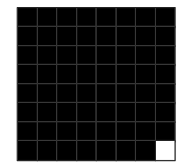
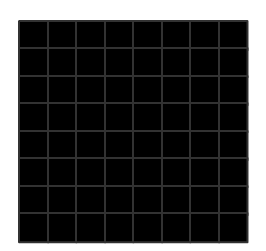
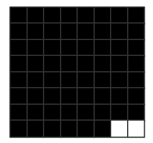
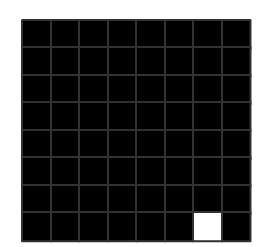
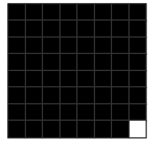
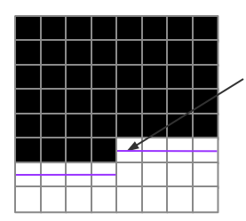
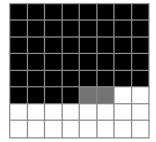
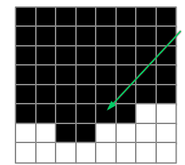

用`1*2`的长方形, 可以横着放，也能竖着放，填充高为`h`，宽为`w`的面积，问有多少种铺法? [原址](http://poj.org/problem?id=2411)

<!--more-->

### 分析

理解他人的思想后，我画几张图进行补充

1）考虑最后一块的情况，如图1，其中黑色的表示已经覆盖了的，白色的表示还没覆盖的（先不要考虑黑色部分是如何覆盖的）



在这种情况下，是没法把全部方块覆盖完的。

接着最后一块的另一种情况，如图2， 如果最后一块被覆盖了，说明任务完成。



2）在考虑最后两块没填的情况，一共有四种可能（`00，01，10，11/0表示没填，1表示填了`），这里先看`00`的情况，图3:



这时候刚好可以横着放下一块，因此存在一种覆盖方法。如果是`01`，图4：这种情况也没法填满了。



（**注意这里的状态表示是从最先的未填充的格子开始记的，因此状态码转换为二进制后，最低位表示的是最先未填充的格子，是反着来的，比如虽然上述状态为`01`，但其实记为状态2，究其原因是倒着从右往左，从下到上导致的，既然这样可以，那顺着从上到下，从左到右也是可以的，那样状态码就不用逆着了**）

如果是`10`，如图5，该填的倒数第二个各自已经填过了，这时候就看倒数第一个格子在当前状态下(没填)，它有几种填充方案，会发现，此时就到了图1的情况了。



因此可以考虑将前面的状态保存起来，让后面的遍历可以直接查询值就好（前提是后边的状态在处理过程中和前边的状态一致了）。

那么要保存多少个状态呢，需要保存一行的状态，每个格子两种状态，一行就是`pow(2, w)`中状态。（为什么要保存一行的状态呢，保存半行，两行行不行呢）

就是说，对于图6箭头所指的方块来说，它要考虑紫线覆盖的方格的所有的状态。



当遍历到的状态，该格子为`0`（没填）时，就需要看能不能横着放，能不能竖着放；如果该格子为`1`，说明填过了，那么该状态下可能的填充方案就取决于前边格子在当前状态下填充的方案。

下面分别考虑这三种情况：

1. 横着放，判断右边是否超边界，且右边的格子状态为`0`，不然右边格子都填过了，还怎么填。假设当前判断的状态为`00000000`，那么可以横着放，放下去之后如下图所示：



这样一来，就多了好多种摆放的方法了，具体多少种呢，只要去查右边的格子，处于状态`10000000`有多少种填充方法即可。

2. 竖着放，竖着放只需要看竖着是否超边界就行，至于当前格子下边那个格子的状态是不用考虑的，因为就保存的一行状态来说，也没保存到它，不如就默认下边的没填，然后更新状态后再去处理，比如这里选择状态为`00110101`，如下图所示：


这样一来，又多了几种摆放方法，多了右边格子处于状态`01101011`（就是去掉当前状态的低位，最高位置为`1`）

3. 已填，比如处理到状态`11000011`时，如下图所示，（此时处理的格子为绿色箭头指的）此时该状态下的填充方法，取决于下一个格子（也就是右边，到了边界就是下一行的开头格子）处于`10000110`状态下的填充方法，注意这时候可不用加了，因为这种情况，本质上并没有引入新的摆放方法。可以考虑图3所示的情况，假如此时处理的是第三个格子（及两白色左边的黑格子），那么状态就为`100`了，由于第三个格子状态为`1`，已经填过了，此状态下，具体有多少种填充方法就看两个白格子了（就一种咯）。



### 代码

```java
public class Poj2411 {
    public static void main(String[] args) {
        System.out.println(filledWithRec(4, 11));
    }

    public static int filledWithRec(int h, int w) {
        if ((h*w & 1) == 1)
            return 0;
        int[][][] dp = new int[h][w][1 << w];
        // dp[i][j][k] represent how many different ways to cover the remainder place after (i, j) at status k
        dp[h - 1][w - 1][0] = 0;
        dp[h - 1][w - 1][1] = 1;

        int[] next = {-1, -1};

        for (int i = h - 1; i >= 0; i--) {
            for (int j = w - 1; j >= 0; j--) {
                boolean hasNext = hasNext(i, j, h, w, next);
                for (int k = 0; k < (1 << w); k++) {
                    // if (i, j) is filled
                    if ((k & 1) == 1) {
                        if (hasNext)
                            dp[i][j][k] = dp[next[0]][next[1]][k>>>1];
                    }
                    else {
                        // fill (i, j) with a 1*2 row, with status 00...
                        if (j+1<w && ((k&2) == 0)) {
                            dp[i][j][k] += dp[next[0]][next[1]][(k|2)>>>1];
                        }
                        // fill (i, j) with a 2*1 column
                        if (i+1 < h) {
                            dp[i][j][k] += dp[next[0]][next[1]][(k>>>1)|(1<<(w-1))];
                        }
                    }
                }
            }
        }
        return dp[0][0][0];
    }

    public static boolean hasNext(int i, int j, int h, int w, int[] next) {
        if (i == h - 1 && j == w - 1)
            return false;
        next[1] = (j + 1) % w;
        next[0] = j == w - 1 ? i + 1 : i;
        return true;
    }
}
```

